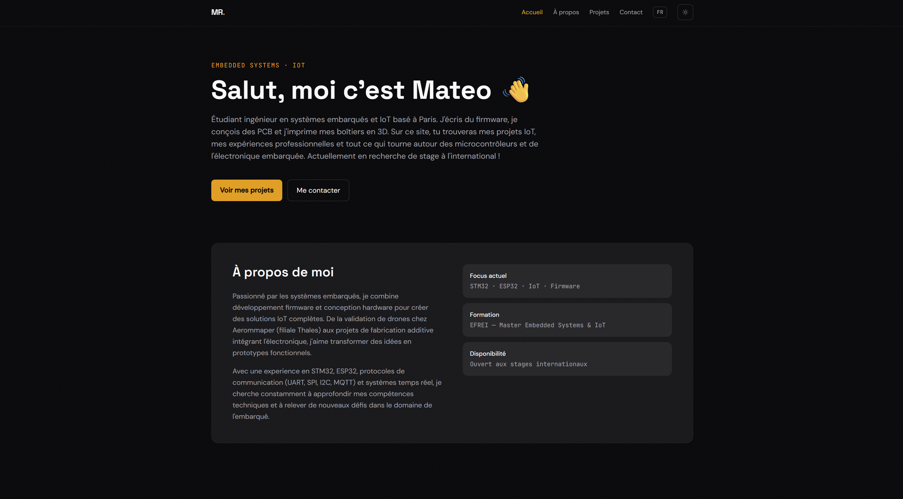
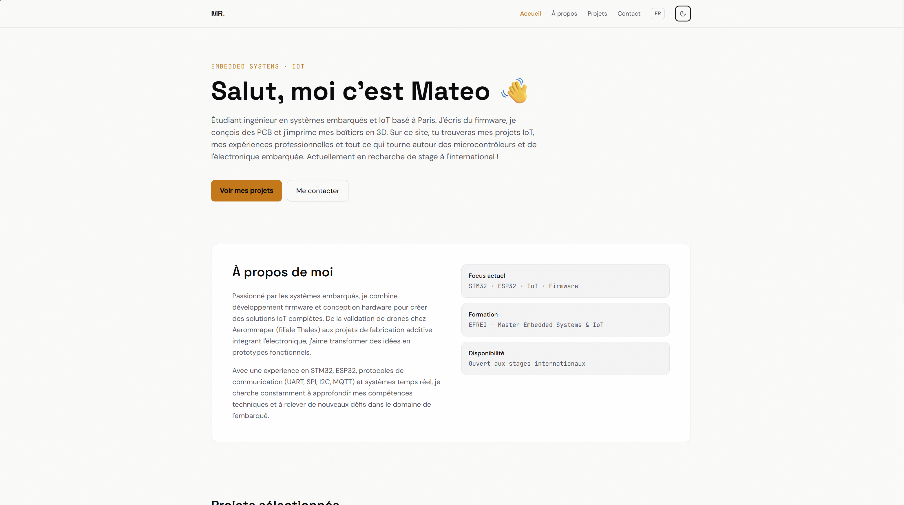

# Matéo Repulles — Portfolio

> Personal portfolio showcasing embedded systems, IoT and electronics engineering projects. Built as a production-grade SPA with a focus on clean architecture, security hardening and design quality.


---

## Preview

| Dark mode | Light mode |
|-----------|------------|
|  |  |

🔗 **Live demo:** [portfolio](https://portfolio.indecis.ovh/)

---

## Features

- **Bilingual (FR / EN)** — Full i18n via `i18next`, language choice persisted across sessions
- **Dark / Light mode** — Defaults to dark, user preference stored in `localStorage`, instant switch with no flash
- **Fluid animations** — Entrance animations and spring-physics hover interactions via Framer Motion; motion only where it adds meaning (no stagger on every element)
- **Security hardened** — Content Security Policy (`script-src 'self'`, no `unsafe-eval`), strict contact form validation (regex + per-field length limits + honeypot anti-bot + 60s send cooldown), secrets in `.env`
- **Data-driven** — Projects and skills maintained in `src/data/` JS files, decoupled from UI components
- **Token-based design system** — Tailwind semantic tokens (`surface`, `text`, `accent`, `border`) driven by CSS variables; single palette swap for a full theme switch across all 13 pages
- **Responsive** — Mobile-first layout throughout, no fixed pixel widths

---

## Tech Stack

| Layer | Technology | Version |
|-------|-----------|---------|
| UI framework | React | 19 |
| Build tool | Vite | 7 |
| Styling | Tailwind CSS | 3.4 |
| Routing | React Router | 7 |
| Animations | Framer Motion | 11 |
| Internationalisation | i18next + react-i18next | 25 / 16 |
| Contact form | EmailJS Browser | 4 |
| Deployment | Azure App Service (Docker) | — |

---

## Project Structure

```
react-portfolio/
├── src/
│   ├── admin/             # Edit mode UI — dev only, stripped from prod builds
│   ├── components/        # Navbar, Footer, ProjectBlocks (block renderer)
│   ├── context/           # ThemeContext — dark/light + localStorage
│   ├── data/
│   │   ├── projects.json  # All project content, as typed blocks
│   │   ├── projects.js    # Asset resolution + i18n key derivation
│   │   ├── blockSchema.js # Block field descriptors — editor & validator
│   │   └── skills.js
│   ├── i18n/              # fr.json, en.json — every user-facing string
│   ├── pages/
│   │   ├── Home.jsx
│   │   ├── About.jsx
│   │   ├── Projects.jsx
│   │   ├── ProjectDetail.jsx  # One generic page for every project
│   │   └── Contact.jsx
│   └── index.css          # CSS custom properties (theme tokens), Tailwind base
├── plugins/content-api.js # Dev-server middleware writing content to disk
├── scripts/check-content.mjs
├── .env.example           # Environment variable template
├── tailwind.config.js     # darkMode: 'class', semantic color tokens, font families
└── index.html             # CSP meta, Google Fonts (Space Grotesk, DM Sans, JetBrains Mono)
```

---

## Getting Started

### Prerequisites

- Node.js ≥ 18
- npm ≥ 9

### Installation

```bash
# 1. Clone the repository
git clone https://github.com/Airvirtex1/Portfolio.git
cd Portfolio/react-portfolio

# 2. Install dependencies
npm install

# 3. Configure environment variables
cp .env.example .env
# Edit .env and fill in your EmailJS credentials (see below)
```

### Environment variables

```bash
# .env — never commit this file (already in .gitignore)
VITE_EMAILJS_SERVICE_ID=your_service_id
VITE_EMAILJS_TEMPLATE_ID=your_template_id
VITE_EMAILJS_PUBLIC_KEY=your_public_key
```

> **Note:** `VITE_` variables are intentionally bundled into the client JS by Vite — this is expected for EmailJS public keys (designed to be client-side). Restrict usage by enabling **Allowed Origins** in your [EmailJS dashboard](https://dashboard.emailjs.com) → Service → Settings.

### Scripts

```bash
npm run dev            # Dev server at http://localhost:5173 (HMR enabled)
npm run build          # Production build → dist/
npm run preview        # Serve the production build locally
npm run lint           # ESLint
npm run check:content  # Validate project content: i18n keys (FR + EN) and assets
```

---

## Architecture Notes

### Token-based theming

Colors are CSS custom properties in `src/index.css`, consumed as Tailwind utilities. Switching themes is a single class toggle on `<html>` — no component-level `dark:` variants scattered across files.

```css
:root  { --surface-base: #fafaf9; --accent: #d97706; /* light */ }
.dark  { --surface-base: #09090b; --accent: #f59e0b; /* dark  */ }
```

### Performance

| Mechanism | Implementation |
|-----------|---------------|
| Code splitting | Automatic per-route via Vite dynamic imports |
| Asset optimisation | Hash-based filenames, Vite image pipeline at build time |
| Font loading | `preconnect` + `display=swap` — no layout shift |
| Animation budget | `viewport: { once: true }` on all scroll-triggered animations |

### Security

| Layer | Measure |
|-------|---------|
| CSP | `script-src 'self'` — no eval, no inline scripts |
| Contact form | Email regex, field length limits (50 / 254 / 2000 chars), honeypot field, 60s cooldown |
| Secrets | All API keys in `.env`, excluded from git via `.gitignore` |
| Headers | `X-Frame-Options: DENY`, `X-Content-Type-Options: nosniff`, `Referrer-Policy: strict-origin-when-cross-origin` |

---

## Content Architecture

Project pages are **data, not code**. `src/data/projects.json` describes each project
as an ordered list of typed blocks; `ProjectDetail.jsx` renders any of them through the
`/projects/:id` route. Adding a project touches no JSX and no routing.

| Block type | Renders |
|-----------|---------|
| `image` / `figure` | Full-width image, or titled image with caption |
| `cards` | Grid of icon + title + text cards (`compact` variant for the overview row) |
| `text` | Titled panel with N paragraphs |
| `steps` | Numbered approach steps |
| `stack` | Technical stack in labelled columns |
| `highlight` | Accent panel (7 colours), optional badge and item grid |
| `challenges` | Problem / solution pairs |
| `stats` | Key figures with captions |

All user-facing text lives in `src/i18n/*.json` under `project.<namespace>.*`; blocks
only reference keys. A block whose image is missing from `src/assets/` is skipped at
render time rather than showing a broken image.

### Adding a project — edit mode

```bash
npm run dev     # then open http://localhost:5173/admin
```

The editor lists every project, edits blocks with FR and EN fields side by side, shows a
live preview using the real page renderer, and uploads images straight into `src/assets/`.
Saving writes `src/data/projects.json` and both i18n files — then commit as usual.

Edit mode is served by a Vite dev-server middleware (`plugins/content-api.js`) declared
`apply: "serve"`. It is absent from production builds: the deployed site stays a static
SPA with no backend and no write surface.

### Adding a project — by hand

1. Drop the image in `src/assets/`
2. Add the entry in `src/data/projects.json` (`id`, `image`, `tags`, `blocks`)
3. Add the strings in `src/i18n/fr.json` and `en.json` under `project.<id>`
4. Run `npm run check:content` to confirm no key or asset is missing

---

## License

MIT — feel free to use this as a template for your own portfolio.
